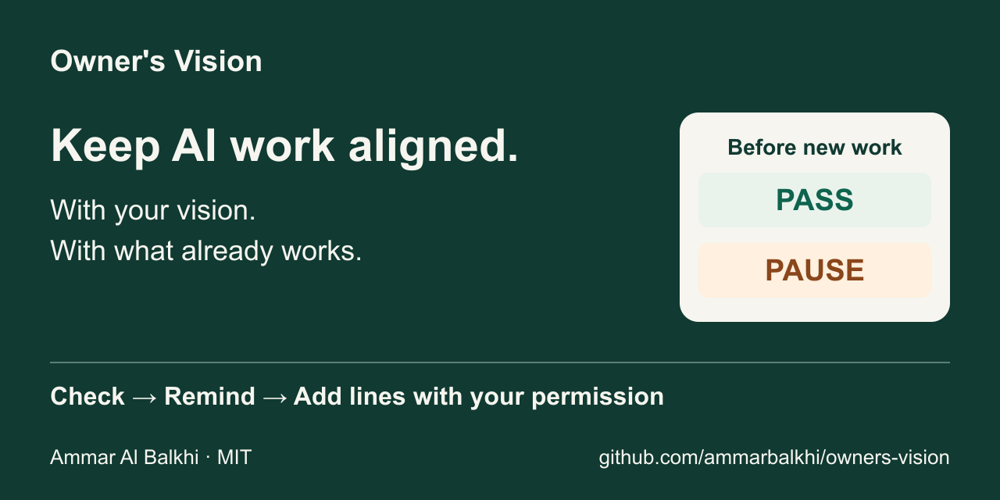

# Owner's Vision

**Keep AI work aligned.**

Owner's Vision helps AI coding agents keep long projects aligned with your requirements and completed work. **The Hand of the Owner** checks each proposed step against that saved record and pauses implementation when something conflicts or cannot be verified.

Created by [Ammar Al Balkhi](https://github.com/ammarbalkhi) · [MIT](LICENSE) · [v0.1.0](https://github.com/ammarbalkhi/owners-vision/releases/tag/v0.1.0) · Early release



[See the workflow and text explanation](docs/demo.md).

## Install

From the project where you want to use the skill:

```bash
npx skills add ammarbalkhi/owners-vision --skill owners-vision --copy
```

Select your agent if prompted. This [Skills CLI](https://github.com/vercel-labs/skills) route needs Node.js 22.20 or newer. Every route needs Python 3 and access to the project files.

| Your setup | Start here |
| --- | --- |
| Agent with skill discovery | Copy the complete `owners-vision/` folder into its project skill directory, then select the skill. |
| Agent that reads files | Ask it to read `owners-vision/SKILL.md` and use the skill for this project. |
| CLI that accepts instruction text | Run `python owner_vision.py instructions` from a clone; use the CLI's documented input option. |
| Manual download | [Download the skill ZIP](https://github.com/ammarbalkhi/owners-vision/releases/latest/download/owners-vision.zip) and extract `owners-vision/`. |

[Installation paths, host support and CLI reference](docs/agent-usage.md).

## First use

Ask your agent to use Owner's Vision for this project. Tell it **what the finished project should do and what future work must preserve**. If you are unsure, the agent helps clarify the destination and drafts a vision for your approval.

Once you approve the vision and initial setup, the agent handles the files, integrity lock and project rule that requires the Hand before implementation. You do not need to calculate hashes yourself. Existing approvals are reused; an existing vision is checked before any setup changes.

An agent-managed install or update must report project readiness immediately. After a manual or CLI-only installation, invoke the skill so the agent performs that check.

<details>
<summary>Manual project setup</summary>

After the owner approves the vision and setup:

1. Write the vision using the [template](owners-vision/assets/OWNER_VISION.md).
2. Create its SHA-256 companion lock.
3. Record the accepted digest and mandatory Hand instruction in the project's governing rules.

The [complete manual procedure](docs/agent-usage.md#manual-project-binding) includes the command and instruction template. Never regenerate an established lock to make a failed check pass.

</details>

## How it works

1. **Check.** Verify that the saved vision matches its lock, then review the proposed work against the destination and recorded accomplishments. A fresh read-only subagent is required when supported; otherwise, the same agent performs a dedicated review and identifies that method.
2. **Decide.** **PASS** lets already-authorized work continue. **PAUSE** stops implementation when integrity, alignment or review remains unresolved. A successful hash check alone cannot grant PASS.
3. **Remind.** At the next major step, after the lock verifies, the Hand can give one brief reminder about the previous step's verified accomplishments that are not yet recorded.
4. **Add lines.** Only after you explicitly authorize the addition, the agent appends concise facts and synchronizes the declared digests. Every earlier byte stays intact.

You authorize additions in your own words. A PASS, silence or “looks good” does not authorize them. Waiting for that permission does not block otherwise authorized work that passes the gate.

## Try the integrity check in a minute

With Python 3 installed:

```bash
git clone https://github.com/ammarbalkhi/owners-vision.git
cd owners-vision
```

Check an intact test fixture:

```bash
python owner_vision.py check --vision tests/fixtures/01-aligned-prior-accomplishment/OWNER_VISION.md --lock tests/fixtures/01-aligned-prior-accomplishment/OWNER_VISION.sha256 --expected-sha256 268e3c977418d1c58a9c4df669ffbd89c6d9e48822864f37493a45cd37f62a13
```

Expect `"ok": true` and exit code `0`. Now check an altered copy:

```bash
python owner_vision.py check --vision tests/fixtures/04-tampered-vision/OWNER_VISION.md --lock tests/fixtures/04-tampered-vision/OWNER_VISION.sha256 --expected-sha256 268e3c977418d1c58a9c4df669ffbd89c6d9e48822864f37493a45cd37f62a13
```

Expect `"ok": false`, `VISION_DIGEST_MISMATCH` and exit code `1`. Neither command changes files. Use `python3` if that is your system's Python 3 command. This demonstrates file integrity; the Hand also needs alignment review.

## Evidence

Windows test evidence; each behavioral receipt identifies its tested instructions and scope.

| Check | Recorded result | Coverage |
| --- | --- | --- |
| [Integrity](tests/run_tests.py) | 12/12 pass | Altered or missing inputs, accepted digests, lock format and append synchronization |
| [CLI](tests/test_cli.py) | 6/6 pass | Instruction export, paths, JSON output, exit codes and tampering without repair |
| [Installation and readiness](tests/readiness-trials.md) | 6/6 intended outcomes observed | Immediate setup assessment, approval, prior stop, broken lock and review methods |

[Full evidence, earlier trials and reproduction instructions](tests/README.md).

- The integrity check is deterministic; alignment and authorization depend on the agent following the instructions.
- Behavioral trials are bounded observations. Some host restrictions were simulated; reliability across every agent and operating system is unproven.
- An earlier failed-lock trial incorrectly offered a reminder. The rule was corrected and independently rechecked; earlier cases were not all rerun after every later change.

## Design choices

- **A fixed reference:** the vision, companion lock and separately accepted digest must agree.
- **Protected progress:** authorized accomplishment lines become checkpoints future work must preserve.
- **Owner control:** review cannot approve a new direction or grant permission to add lines.

The portable [skill](owners-vision/SKILL.md) includes its [setup procedure](owners-vision/references/setup.md). The [usage guide](docs/agent-usage.md) covers manual integration; [test documentation](tests/README.md) keeps the detailed evidence.

## Feedback

Try it on a disposable project, then [report a problem or suggest an improvement](https://github.com/ammarbalkhi/owners-vision/issues/new/choose). Include what you asked, what happened and the agent environment. Remove private project details before posting.

## License

MIT © Ammar Al Balkhi. See [LICENSE](LICENSE).
