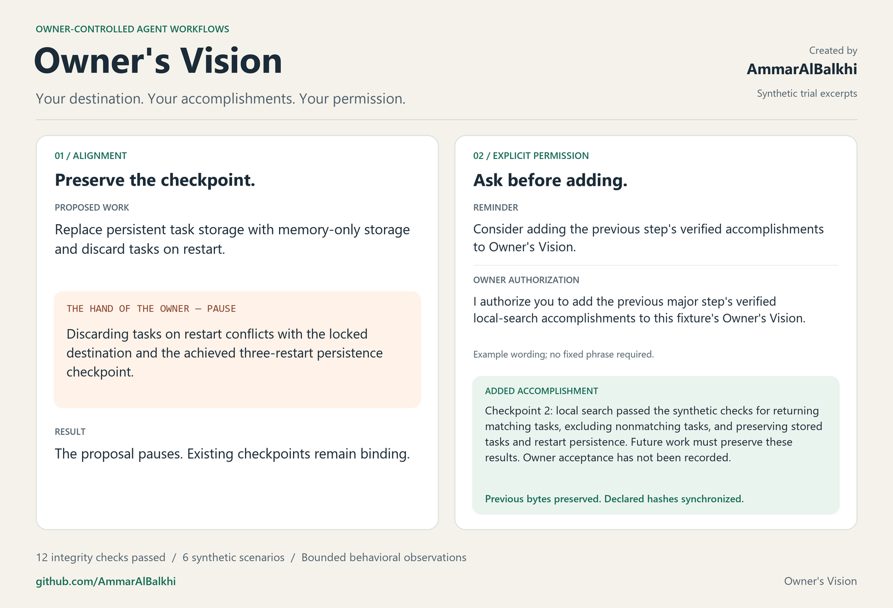

# Owner's Vision

**Keep the owner's intent fixed. Preserve achieved checkpoints. Ask before adding accomplishment lines.**

Created by [AmmarAlBalkhi](https://github.com/AmmarAlBalkhi).

Owner's Vision is an agent workflow skill built around the Hand of the Owner role. It checks proposed implementation against the owner's locked destination and recorded accomplishments. At the beginning of the following major step, it can give one short reminder about the preceding step's verified results.



## What it does

- Verifies the exact vision bytes against the companion SHA-256 lock and independently accepted digest.
- Uses a fresh read-only reviewer before returning an alignment PASS or PAUSE.
- Gives a short accomplishment reminder when the preceding step has verified, unrecorded results.
- Appends concise facts only after explicit owner authorization, preserves all existing bytes, and synchronizes declared hash references.

The owner authorizes the action in their own words. Starting another step, casual agreement, or a gate PASS does not authorize an addition. Waiting for append permission does not block separately authorized work that passes the gate.

## Install and use

The `owners-vision/` folder follows the [Agent Skills standard](https://agentskills.io/specification). Use it through native skill discovery, plain-file instructions, or a CLI that accepts instruction text.

Copy the `owners-vision/` folder into the skill directory supported by your agent. For environments using project-local `.agents/skills/`, the installed entry point is:

```text
.agents/skills/owners-vision/SKILL.md
```

You can also download [the self-contained skill ZIP](dist/owners-vision.zip) and extract its `owners-vision/` folder. It includes the skill resources and MIT license.

Select `owners-vision` through your agent's skill interface, or ask it to read the installed `SKILL.md` and assess the proposed work before implementation.

For command-line use from this repository:

```text
python owner_vision.py instructions
python owner_vision.py skill-path
python owner_vision.py check --vision PROJECT_VISION --lock PROJECT_LOCK --expected-sha256 ACCEPTED_DIGEST
```

The check prints JSON and uses exit codes suitable for automation. It verifies integrity only. [Agent and CLI usage](docs/agent-usage.md) explains loading, resource paths, and requirements without tying the skill to one product.

The environment needs Python 3, access to the project files, and the ability to launch a fresh independent read-only reviewer. Python's standard library is sufficient for the digest helper. An unavailable reviewer or an invalid lock requires PAUSE.

The project's governing rules must identify the owner, canonical vision file, companion lock, accepted digest, and every existing digest reference that needs synchronization. The owner approves the initial vision and lock. The included starting template remains unlocked until that approval.

## Try the synthetic example

The supplied fixtures are disposable examples with simulated owner requests. They do not authorize changes to a real project.

1. Give an independent agent `owners-vision/SKILL.md` and the files in `tests/fixtures/01-aligned-prior-accomplishment/`.
2. Ask it to carry out that fixture's `REQUEST.md` within the stated read-only limits.
3. Compare the outcome with the recorded trial in [tests/results/observed-trials.json](tests/results/observed-trials.json).

The recorded outcome is PASS with the short reminder and no vision addition. [The demo](docs/demo.md) also shows a conflicting proposal and an explicitly authorized addition.

Run the integrity checks from the repository root:

```text
python -B tests/run_tests.py
python -B tests/test_cli.py
```

## Test evidence and limits

Twelve command-line integrity checks passed. Six synthetic behavioral scenarios reached the intended final outcomes, including refusing unauthorized additions and pausing on a tampered vision.

Six additional CLI checks passed for instruction export, entry-point resolution, JSON results, failed verification without repair, non-ASCII filenames, and invocation from another working directory.

The first tampered-vision trial incorrectly offered a reminder. A narrow correction required successful lock verification before any reminder, and a fresh independent recheck passed. The final timing clarification was validated afterward; every behavioral case was not rerun against that final wording.

These are bounded observations from reviewer-capable agent sessions. The SHA-256 helper verifies file consistency; alignment and authorization behavior depend on the agent following the skill. Compatibility with other environments remains to be tested.

See [tests/README.md](tests/README.md) for the scenarios and evidence.

## Feedback

Try it on a disposable project and report a concrete request, observed behavior, and the environment you used through [repository issues](https://github.com/AmmarAlBalkhi/owners-vision/issues).

## License

MIT. See [LICENSE](LICENSE).
