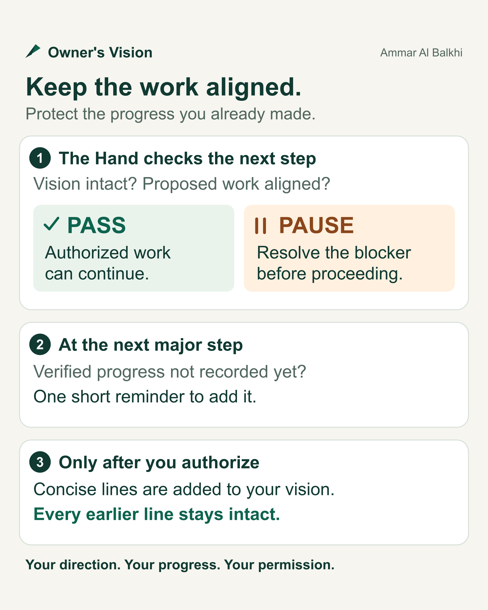

# Owner's Vision: pictures for sharing

Created by Ammar Al Balkhi.

[Workflow picture](../demo.png) · [LinkedIn cover](owners-vision-cover.png) · [Ready-to-copy post](linkedin-post.txt)

Upload either PNG with the post. Both use the skill's actual verdicts: **PASS** and **PAUSE**.

- **PASS:** integrity and alignment checks pass; already-authorized work can continue.
- **PAUSE:** a conflict or unresolved check stops implementation until it is resolved and checked again.
- **Reminder:** at the next major step, the Hand can suggest recording verified accomplishments. Adding them requires explicit owner authorization and preserves every earlier line.

These are workflow illustrations. [Text explanation and recorded evidence](../demo.md).

Editable sources: [workflow SVG](../demo.svg) · [LinkedIn SVG](owners-vision-cover.svg). The [social preview](../social-preview.png) is sized for repository link cards.
